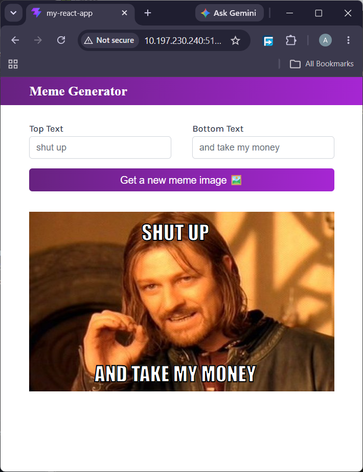

# Meme Generator
A fully responsive meme generator app for creating custom memes, built using React with Vite and vanilla CSS.

## 📖 About The Project
This is a fully responsive meme generator built with React and Vite. It fetches meme templates from the Imgflip API and lets users add custom top and bottom text in real time. The project goes beyond a static template by incorporating dynamic elements like random image selection, controlled form inputs, and live text overlays on meme images.

## 🚀 Live Demo
[View the live project here](https://abdullahalbaaj.github.io/memes-generator/)

## 🛠️ Built With
- **React 18** – Component-based UI with hooks (`useState`, `useEffect`)
- **Vite** – Fast build tool and dev server
- **CSS3** – CSS Variables, Flexbox, Media Queries
- **JavaScript (JSX)** – DOM manipulation, Fetch API, Event Handling
- **Google Fonts** – Karla typeface
- **Imgflip API** – Meme template data

## ✨ Key Features
- **Fully Responsive**: Optimized for all screen sizes with a mobile-friendly layout.
- **Random Meme Image**: Fetches 100+ templates and picks a random one on button click.
- **Live Text Editing**: Top and bottom text update the meme in real time via controlled inputs.
- **Dynamic API Fetch**: Meme templates loaded once on mount using `useEffect`.
- **State Management**: Single `meme` state object updated with spread operator.
- **Modular Components**: Clean separation between `Header`, `Main`, and `App`.
- **Styled Meme Text**: Impact font with black stroke for authentic meme look.

## 📸 Screenshot

## 📂 Project Structure
my-react-app/
├── public/
│ ├── styles.css
│ └── favicon.svg
├── src/
│ ├── components/
│ │ ├── Header.jsx
│ │ └── Main.jsx
│ ├── App.jsx
│ └── index.jsx
├── index.html
├── package.json
└── vite.config.js
